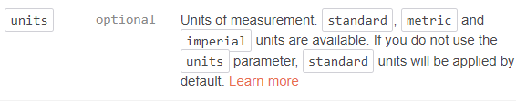

# Weatherapp

## Weather App inspired by teacher Thomas Basham

### API provided by open weather map. For more info, visit <https://openweathermap.org/api>

### Check out the readme file, use at your discretion

## Resources

### Utilized postman to get the API ID. For more info, visit <https://web.postman.co/workspace/My-Workspace~e3aea02d-d4ee-4b2e-8830-57471f61db4c/request/create?requestId=5fc1330d-26de-46a5-aae6-19af5717863d>

### The weather app is designed to input locations from anywhere in the world and get the current weather. This weather app can be used on any device. No more looking out the window to see if it is raining. It will now be at the tip of your fingertips

### Utilized google for the image used on the app img src="nikos world.jpg"

### googled to learn how to change the temperature from celcius to farenheit by using imperial as my units using the imgae below

### Bootstrap used to upgrade the look of the app

test